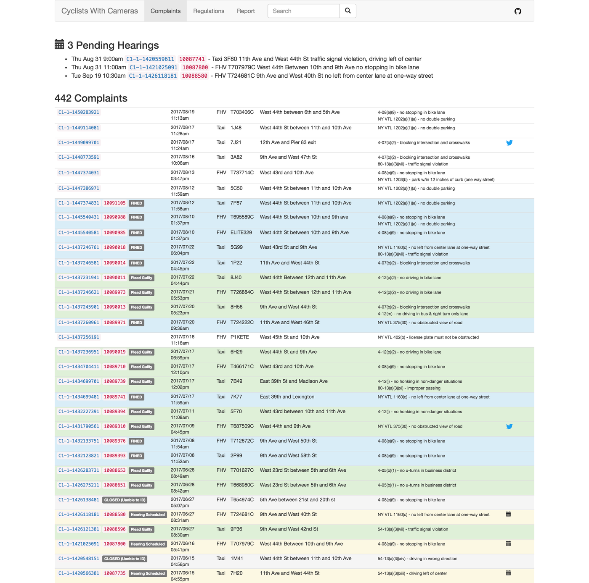

cwc -> Cyclists With Cameras

For more information on CyclistsWithCameras see [here](https://github.com/jehiah/safe_streets/blob/master/cyclists_with_cameras.md)

This repository is a set of command line utilities for managing a database of complaints. 

Included are the following utilities:

* `cwc` - a multi-purpose search & report tool
* `reports.sh` generate statistics (i.e [this report](https://on.jehiah.cz/29J6lIX))
* `sync_w_gmail` a tool to extract 311 updates from the TLC and update matching `notes.txt` files

## File Format

`cwc` expects complaints to be stored one per directory in a directory named `YYYYMMDD_HHMM_$LICENSE`. The default location for these is `~/Documents/cyclists_with_cameras`.

A directory is a spot to combine your notes on the complaint (in a `notes.txt` file) and all the images or video related to that complaint. 

The `notes.txt` is a required file and MUST have the first line in the following format. All other file context are unstructured but typically there is a paragraph of the complaint text, a line specifying which photos were uploaded, the 311 number, and then single line notes with updats from the TLC.

```
YYYY/MM/DD hh:mm:p [Taxi|FHV] $LICENSE $LOCATION

At <LOCATION> I observed <VEHICLE> <VIOLATION>. Pictures included.
  
C-1-1-123445678
```

## cwc

```
$ ./bin/cwc help
Cyclists With Cameras - utilities for managing a database of T&LC complaints.

For more information see https://github.com/jehiah/cwc

Usage:
  cwc [command]

Available Commands:
  edit        Edit complaint notes.txt
  help        Help about any command
  json        Output all complaints as JSON
  new         New Complaint
  reg         List Regulations
  report      Text format summarized view of report activity
  search      Search for a complaint by keword
  server      Web UI for viewing reports and adding notes
  version     Print the version number

Flags:
  -h, --help   help for cwc
```

Most commands take a  `--db` flag that defaults to `~/Documents/cyclists_with_cameras`


### cwc search

cwc is a flexible tool for searching for keywords in complaints. This is helpful when reviewing cases with the TLC as you can search for the TLC complaint number, the 311 number, the license plate, or anything that is present in the notes file.

```
$ cwc search 4K45
Searching for: "4K45"
opening: 4K45 - Fri Jul 29 2016 5:48pm /Users/jehiah/Documents/cyclists_with_cameras/20160729_1748_4K45
also found: 4K45 - Fri Jul 8 2016 4:20pm /Users/jehiah/Documents/cyclists_with_cameras/20160708_1620_4K45
```

### cwc new - complaint creation tool

`cwc new` is a tool to walk through generating a detailed consistent complaint. It helps you gather information, make sure you have a clear complaint and a clearly identified violation.

An example of how this works is below:

```
$ cwc new
Date (YYYYMMDD) or Filename: /Users/jehiah/Downloads/IMG_0421.JPG 

> using EXIF time 2016/08/31 6:00pm

License Plate: 8L56

Taxi [y/n] (Default is y): 

Where: West 21st St between 5th and 6th Ave

> creating /Users/jehiah/Documents/cyclists_with_cameras/20160831_1800_8L56

Violation: 

1. no driving in bike lane
2. no stopping in bike lane
3. no pickup or discharge of passengers in bike lane
4. no parking on sidewalks
5. blocking intersection and crosswalks
6. no u-turns in business district
7. no honking in non-danger situations
8. no driving in bus & right turn only lane
9. no right from center lane
10. no left from center lane when both two-way streets
11. no left from center lane at one-way street
12. no passing zone
13. license plate must not be obstructed
14. no side window tint below 70%
15. no obstructed view of road
16. cell-phone use while driving
17. park w/in 12 inches of curb (two way street)
18. park w/in 12 inches of curb (one way street)
19. no blue lights except emergency vehicles
20. no double parking
21. no driving on sidewalks
22. threats, harassment, abuse
23. use or threat of physical force
24. yield sign violation
25. following too closely (tailgating)
26. failing to yield right of way
27. traffic signal violation
28. stop sign violation
29. improper passing
30. unsafe lane change
31. driving left of center
32. driving in wrong direction
33. Speeding 1 to 10 mph above speed limit
34. Speeding 11 to 20 mph above speed limit
35. Speeding 21 to 30 mph above speed limit
36. Speeding 31 to 40 mph above speed limit
37. Speeding 41 or more mph above speed limit
38. no smoking

Enter a number: 2

1. At <LOCATION> I observed <VEHICLE> <VIOLATION>. Pictures included.
2. <VEHICLE> stopped in bike lane, dangerously forcing bikers (including myself) into traffic lane <VIOLATION>. Pictures included.
3. <VEHICLE> stopped in bike lane, obstructing my use of bike lane <VIOLATION>. Pictures included.
4. While near <LOCATION> I observed <VEHICLE> stopped in bike lane <VIOLATION>. Pictures included.

Enter a number (Default is 1): 2

> opening https://www1.nyc.gov/apps/311universalintake/form.htm?serviceName=TLC+FHV+Driver+Unsafe+Driving
> done
```

### cwc server

```
Usage:
  cwc server [flags]

Flags:
      --addr string            http listen address (default ":5300")
      --db string              DB path (default "/Users/jehiah/Documents/cyclists_with_cameras")
  -h, --help                   help for server
  -t, --template-path string   path to templates (default "src/templates")
```




## sync_w_gmail

This utility extracts 311 update information from Gmail and updates relevant `notes.txt` files.

To use you will need to create/configure a google application (via https://console.developers.google.com/project) with access to the gmail API and store the client secret in `~/.credentials/client_secret.json`. When first run it will prompt for gmail authentication (write access is used to archive emails) and it will store the credentials in `~/.credentials/cwc.json`

```
2017/08/11 19:46:15 [email:15dd2e2daeaec612 2017/08/11 16:01] C1-1-1439952551 Subject:311 Service Request Update #: C1-1-1439952551 , For Hire Vehicle Complaint
2017/08/11 19:46:15 	found related complaint T740155C - Fri Jul 28 2017 4:54pm
2017/08/11 19:46:15 	> Driver stip 10090330S mailed to driver 8/11/17.NT
2017/08/11 19:46:15 	archiving email
2017/08/11 19:46:17 [email:15dd2c162e9c4a5e 2017/08/11 15:24] C1-1-1437236951 Subject:311 Service Request Update #: C1-1-1437236951 , Taxi Complaint
2017/08/11 19:46:17 	found related complaint 6H29 - Mon Jul 17 2017 6:59pm
2017/08/11 19:46:17 	> Driver stip 10090019S mailed to driver 8/11/17.NT
2017/08/11 19:46:17 	archiving email
```

This records an entry in the appropriate `notes.txt` relating to the email. For example in `~/Documents/cyclists_with_cameras/20170728_1654_T740155C/notes.txt`

```
[email:15dd2e2daeaec612 2017/08/11 16:01] Driver stip 10090330S mailed to driver 8/11/17.NT
```

and in `~/Documents/cyclists_with_cameras/20170717_1859_6H29/notes.txt` the following was recorded

```
[email:15dd2c162e9c4a5e 2017/08/11 15:24] Driver stip 10090019S mailed to driver 8/11/17.NT
```

The `15dd2c162e9c4a5e` is the Gmail Message ID which will show in the URL when viewing that email in gmail

